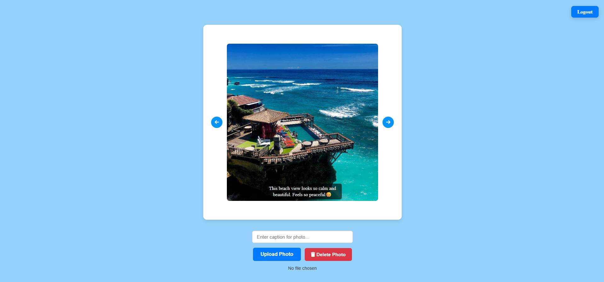

<h1>Image Slider Website</h1>
<h2>Description</h2>

This is a simple image slider website that I have built during my free time using vanilla javascript. This website comes with login page and main page where the main page automatically slides photos and also allows user to navigate rigth or left. User can able to upload and delete photos. User can also write their own caption for each photos. And also audio song is being played as background

<h2>Tech Stack</h2>

● Database and Storage: Supabase

● Hosting: Vercel

● Testing: Playwright

● Programming Language: HTML, CSS and Vanilla Javascript

<h2>Website link:</h2>

https://image-slider-web.vercel.app/

<h2>Screenshots</h2>

